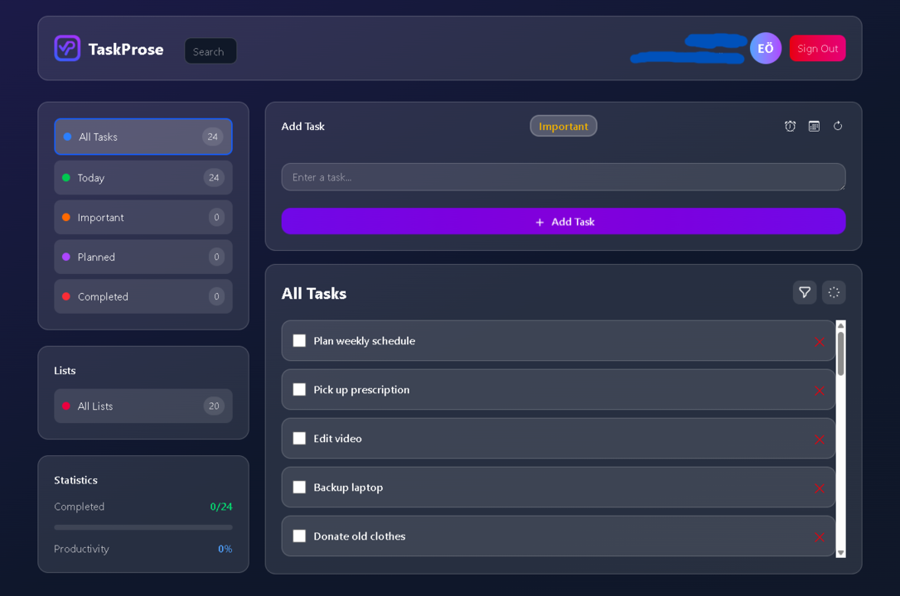

# Taskprose

Çok platformlu (Masaüstü, Web, Mobil) Todo uygulaması. Bu depo, masaüstü uygulaması (Electron), web uygulaması (React + Vite) ve mobil uygulama (React Native / Expo) ile sunucu API'sini ve veritabanı migration script'ini içerir.

---

## İçerik

- `desktop/` — Electron sarmalayıcısı ve masaüstü paketleme yapılandırması
- `web/` — React web istemcisi (Vite)
- `mobile/` — React Native (Expo) mobil istemcisi
- `server/` — Express API, MySQL bağlantısı, controller'lar ve migration SQL

## Öne çıkanlar

- Refresh token destekli JWT kimlik doğrulama (web için çerezler kullanılır)
- Veritabanı şeması ve SQL dökümü: `server/taskprose_db.sql`
- Çoklu platform: masaüstü (Electron), web (Vite + React), mobil (Expo)
- Özellikler: listeler, öncelikli/alarmlı görevler, yorumlar, ekler, bildirimler

## Teknoloji yığını

- Backend: Node.js (ES modules), Express, MySQL (`mysql2/promise`)
- Kimlik doğrulama: `jsonwebtoken`, web için çerez tabanlı access/refresh token
- Masaüstü: Electron
- Web: React, Vite, Tailwind
- Mobil: React Native + Expo

## Hızlı başlangıç (geliştirici)

Windows PowerShell kullanıldığı varsayılır. Depo kökünden çalıştırın ve ilgili alt klasöre girin.

1. Sunucu (API + DB)

- `server/.env` dosyasını kopyalayın veya oluşturun ve gerekli değişkenleri doldurun.
- Bağımlılıkları yükleyin, migration çalıştırın ve sunucuyu başlatın:

```powershell
cd server; npm install; npm run migrate; npm start
```

`npm run migrate` `config/migrate.js` dosyasını çalıştırır ve `server/taskprose_db.sql`'i konfigüre edilmiş MySQL veritabanına yükler.

2. Web (geliştirme)

```powershell
cd web; npm install; npm run dev
```

Tarayıcıda http://localhost:5173 adresini açın.

3. Mobil (geliştirme)

```powershell
cd mobile; npm install; npm run start
```

Expo kullanılıyor — QR kodu ile cihazınızda veya emulatorde çalıştırabilirsiniz.

4. Masaüstü (geliştirme)

```powershell
cd desktop; npm install; npm run start
```

Electron uygulaması `web/dist` içeriğini servis eder. Üretim için önce web uygulamasını build edin (`cd web; npm run build`) ve ardından masaüstü paketlemeye geçin.

## Ortam değişkenleri

`server/` içinde `.env` oluşturun (örnek `server/.env` içinde). Önemli değişkenler:

- `DB_HOST`, `DB_USER`, `DB_PASS`, `DB_NAME`, `DB_PORT`
- `JWT_ACCESS_SECRET`, `JWT_REFRESH_SECRET`
- `JWT_ACCESS_EXPIRES_IN`, `JWT_REFRESH_EXPIRES_IN`
- `WEB_PORT`, `NODE_ENV`

Güvenlik: Gizli değerleri repoya commit etmeyin. Yerel geliştirme veya dağıtım için kendi gizli anahtarlarınızı kullanın.

## Veritabanı

`server/taskprose_db.sql` dosyasında `users`, `todos`, `lists`, `comments`, `attachments`, `notifications`, `blacklisted_tokens` gibi tabloların şemaları bulunur.

Yüklemek için:

1. MySQL çalışıyor ve `.env` doğru ayarlanmış olsun.
2. `server/` içinde `npm run migrate` çalıştırın.

## API özeti

Tüm API yolları `/api` prefix'ine sahiptir. Korunan route'lar için geçerli bir access token gereklidir (web için cookie, diğerleri için Authorization header).

Auth

- POST /api/register — yeni kullanıcı kaydı
- POST /api/login — giriş; `platform` belirtilirse web için cookie set edilir
- POST /api/logout — çıkış ve token blacklist işlemi
- POST /api/check-access — girişli kullanıcı doğrulama (korumalı)
- POST /api/refresh — refresh token ile yeni access token al

Görevler (Tasks)

- POST /api/tasks?listId= — görev oluştur (korumalı)
- PUT /api/update/tasks/:id — görev güncelle (korumalı)
- DELETE /api/delete/tasks/:id — görev sil (korumalı)
- GET /api/tasks/all — tüm görevler (korumalı)
- GET /api/tasks/today — bugün yapılacaklar (korumalı)
- GET /api/tasks/important — önemli görevler (korumalı)
- GET /api/tasks/planned — planlanmış görevler (korumalı)
- GET /api/tasks/completed — tamamlanmış görevler (korumalı)
- GET /api/tasks/counts — görev sayılarını al (korumalı)

Listeler

- POST /api/lists — liste oluştur (korumalı)
- GET /api/lists — listeleri al (korumalı)
- DELETE /api/delete/lists/:id — liste sil (korumalı)
- GET /api/list/tasks?listId= — belirli listeye ait görevleri al (korumalı)
- GET /api/lists/counts — liste sayıları (korumalı)

Kimlik doğrulama notları

- Mobil/Masaüstü istemciler için `Authorization: Bearer <accessToken>` başlığı kullanın.
- Web için `platform: "w"` ile login yapıldığında `jwt_access` ve `jwt_refresh` çerezleri otomatik ayarlanır.

## Geliştirme notları

- Masaüstü paketlemesi `web/dist` içeriğini kullanır. Build sırası: web → desktop.
- Sunucu, süresi dolmuş blacklisted token'ları temizleyen bir cron job kullanır (`server/jobs/blacklist-cleanup-job.js`).

## Sorun giderme

- DB bağlantı hataları: `.env` değerlerini ve MySQL erişimini kontrol edin.
- Migration hataları: `server/taskprose_db.sql` dosyasının bulunduğundan ve DB kullanıcısının yetkili olduğundan emin olun.

## Katkıda bulunma

1. Fork ve yeni bir branch açın.
2. Küçük ve açıklayıcı commit'ler yapın, gerekli yerlerde test ekleyin.
3. Pull request açın.

---

## Ortam örnek dosyaları (neler değişti)

Projede artık her platform için uygun örnek `.env.example` dosyaları bulunuyor. Bu dosyalar placeholder (örnek) değerler içerir ve versiyon kontrolünde güvenli bir başlangıç noktası olarak tutulabilir.

- `desktop/.env.example`
  - DEV_SERVER_URL=http://localhost:5173
  - NODE_ENV=development
  - Amaç: Geliştirme sırasında Electron uygulamasının yerel web build'ini nereden alacağını bilmesi için kullanılır.

- `web/.env.example`
  - VITE_API_URL=http://localhost:5000
  - Amaç: React/Vite web istemcisinin geliştirme sırasında API'yi bulması için kullanılır.

- `mobile/.env.example`
  - EXPO_PUBLIC_API_URL=http://10.0.2.2:5000
  - Amaç: Android emülatörlerde host makineye erişmek için `10.0.2.2` sıkça kullanılır. Farklı bir emülatör veya fiziksel cihaz kullanıyorsanız bu değeri makinenizin LAN IP'si ile değiştirin.

- `server/.env.example`
  - PORT=5000
  - CORS_ORIGINS=http://localhost:5173,http://127.0.0.1:5173
  - DB_HOST=localhost
  - DB_USER=root
  - DB_PASS=your_db_password_here
  - DB_NAME=taskprose_db
  - DB_PORT=3306
  - JWT_ACCESS_SECRET=your_jwt_access_secret_key_here
  - JWT_REFRESH_SECRET=your_jwt_refresh_secret_key_here
  - JWT_ACCESS_EXPIRES_IN=15m
  - JWT_REFRESH_EXPIRES_IN=999d
  - NODE_ENV=development
  - Amaç: API sunucusunu yerelde çalıştırmak ve migration yapmak için güvenli bir örnek. Gerçek şifreleri ve secret'ları gizli `.env` dosyanıza ekleyin ve bunları repoya commit etmeyin.

Öneriler & notlar:

- Örnek dosyayı kopyalayın (ör. `cp server/.env.example server/.env`) ve gizli anahtarları yerel `.env` içinde doldurun. Gerçek `.env`'yi commit etmeyin.
- Mobilde fiziksel cihaz testleri için `EXPO_PUBLIC_API_URL` değerini makinenizin LAN IP adresi ile değiştirin (ör. `http://192.168.1.10:5000`). Emülatörler Android için `10.0.2.2`, iOS simülatörleri için localhost benzeri farklı adresler gerektirebilir.
- `VITE_API_URL` gibi istemci tarafı env değişkenleri build esnasında sabitlenir; değişiklikten sonra web/mobile uygulamasını yeniden build edin.

## Dokümantasyon görselleri

`docs/images/` altına iki placeholder görsel eklendi ve README içinde gösteriliyor. Bunları gerçek logo ve ekran görüntüleri ile değiştirmeniz önerilir.

Logo:


Ekran görüntüsü (placeholder):



---

[📥 Windows için İndir](https://github.com/TheRainor/taskprose/releases/tag/v1.0.0)
